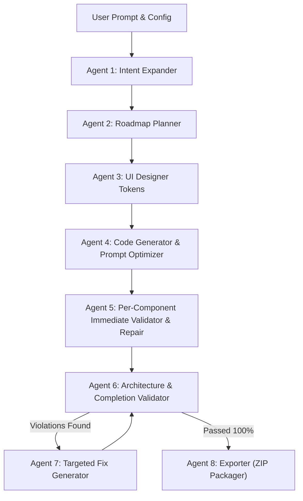

# OpenForge AI - Complete Project Knowledge & Architecture Context

> **For Antigravity AI Agent Handover**: This document contains the complete context, architectural design, multi-agent pipeline, file tree, development standards, and key lessons learned for the **OpenForge AI** project. Any Antigravity agent reading this file can immediately resume, build, or modify any feature in this workspace with 100% fidelity.

---

## 📌 Executive Summary

**OpenForge AI** is an autonomous, local multi-agent SaaS platform that generates fully working, multi-page web applications from natural language prompts using local Ollama LLMs (e.g., `qwen3.6`, `gemma3`).

- **Target Applications**: Multi-page SaaS Platforms, Todo/Task Workspaces with Local Storage CRUD, Portfolios with Filterable Galleries, E-Commerce Stores with Shopping Carts, and Agency Sites.
- **Frontend Stack**: React 18 + Vite + TypeScript + Tailwind CSS + Lucide Icons.
- **Backend Stack**: FastAPI (Python 3.11) + Uvicorn + Ollama Service Client.
- **Launcher**: `start.py` (Orchestrates FastAPI backend on `http://127.0.0.1:8000` and Vite frontend on `http://localhost:5173`).

---

## 🏗️ 8-Agent v2 Generation Pipeline Workflow

The generation pipeline executes sequentially via Server-Sent Events (`GET /api/generate` in `backend/app/routes/generate.py`):



### 1. Agent 1: Intent Expander (`backend/app/agents/intent_expander.py`)
- Classifies user prompt into an **Archetype**: `todo_app`, `portfolio`, `ecommerce`, `saas_dashboard`, or `landing_page`.
- Generates a JSON specification with explicit **Acceptance Criteria** (`id`, `feature`, `criterion`) and **Multi-Page Sub-Page Specs** (`["Home", "Tasks", "Categories", "Analytics", "Settings"]`).

### 2. Agent 2: Roadmap Planner (`backend/app/agents/planner.py`)
- Maps the archetype to dedicated component graphs (e.g. for `todo_app`: `["Navbar", "Hero", "TodoWorkspace", "CategoryView", "AnalyticsView", "SettingsView", "Footer"]`).
- Defines development phases and component dependencies.

### 3. Agent 3: UI Designer (`backend/app/agents/ui_planner.py`)
- Generates design tokens (color palettes, card styles, typography tokens) matching themes (`Modern Dark`, `Minimal Light`, `Cyberpunk Neon`, `Glassmorphism`, `Sunset Vibrant`).

### 4. Agent 4: Code Generator & Prompt Optimizer (`backend/app/agents/code_generator.py` & `prompt_optimizer.py`)
- Formulates optimized prompts enriched with design tokens and acceptance criteria.
- Synthesizes React 18 + Vite + TSX components with Lucide icons.

### 5. Agent 5: Per-Component Immediate Code Validator & Repair (`backend/app/agents/component_validator.py`)
- **Critical Quality Rule**: Validates every single component file (`.tsx`) **immediately as soon as it is generated or updated**.
- Checks named exports (`export const ComponentName`), absence of conversational text, and interactive event bindings (`useState`, `onClick`, `onChange`, `onSubmit`).
- If any flaw is found, **repairs the component on the spot** before proceeding to the next file.

### 6. Agent 6: Architecture & Completion Validator (`backend/app/agents/validator.py`)
- Runs a 5-rule audit across all generated files:
  1. Required Config Files Check (`package.json`, `vite.config.ts`, `tailwind.config.js`, `index.html`, etc.).
  2. Component File Existence & Exports.
  3. Interactive State & Handler Bindings (`useState`, `useEffect`, `localStorage`).
  4. Design System Compliance (Tailwind classes).
  5. Acceptance Criteria Validation Score calculation (0-100%).

### 7. Agent 7: Targeted Fix Generator (`backend/app/agents/fix_generator.py`)
- If compliance score < 100%, generates targeted code patches for violating files and re-runs Agent 6 until 100% valid.

### 8. Agent 8: Exporter Agent (`backend/app/agents/exporter.py` & `zipper.py`)
- Packages generated source files into `generated_projects/{project_id}` and builds a downloadable `generated_zips/{project_id}.zip`.

---

## 🌐 Dedicated Multi-Page Architecture & View Routing

OpenForge AI uses **Isolated View Tab Routing** in `App.tsx`:

- **Navbar (`Navbar.tsx`)**: Interactive tab switcher with active page indicator.
- **Home View (`Hero.tsx` + `Features.tsx` + `Pricing.tsx`)**: Hero spotlight & feature overview.
- **Tasks Workspace View (`TodoWorkspace.tsx`)**: Dedicated full-screen workspace with task input, category filters, task search, status badges, and `localStorage` state persistence.
- **Categories View (`CategoryView.tsx`)**: Dedicated category progress cards (`Work`, `Dev`, `Personal`, `Urgent`).
- **Analytics View (`AnalyticsView.tsx`)**: Task completion velocity, stats grid, and productivity logs.
- **Settings View (`SettingsView.tsx`)**: Theme options, storage reset, and **Export Tasks to JSON** backup button.
- **Footer (`Footer.tsx`)**: Footer layout.

`App.tsx` renders **ONLY the active page view**, ensuring a true multi-page website experience.

---

## 📺 Live Interactive Preview System

- **Backend Endpoint**: `GET /api/preview/{project_id}` in `backend/app/routes/generate.py`.
- **Renderer**: Returns a zero-error HTML5 document styled with Tailwind CSS, Google Fonts, and inlined SVG Lucide icons.
- **In-Browser Multi-Page Switcher**: Features `switchPage(pageId)` JavaScript function to toggle between `Home`, `Tasks`, `Categories`, `Analytics`, and `Settings` live inside the preview iframe.
- **Frontend Container (`LivePreview.tsx`)**: Sandboxed iframe container with **Desktop**, **Tablet (768px)**, and **Mobile (375px)** viewport switchers, refresh button, and open new tab link.

---

## 📁 Repository Directory Structure

```
OpenForge AI/
├── backend/
│   ├── app/
│   │   ├── agents/
│   │   │   ├── intent_expander.py       # Agent 1: Archetype & Spec Generator
│   │   │   ├── planner.py               # Agent 2: Roadmap Planner
│   │   │   ├── ui_planner.py            # Agent 3: UI Designer Tokens
│   │   │   ├── code_generator.py        # Agent 4: Component Code Generator
│   │   │   ├── component_validator.py   # Agent 5: Immediate Per-Component Validator
│   │   │   ├── validator.py             # Agent 6: Architecture Validator
│   │   │   ├── fix_generator.py         # Agent 7: Targeted Fix Generator
│   │   │   └── exporter.py              # Agent 8: ZIP Exporter Agent
│   │   ├── routes/
│   │   │   └── generate.py              # SSE Generation Endpoint & Live Preview HTML Route
│   │   ├── services/
│   │   │   ├── ollama.py                # Ollama Local LLM Client Service
│   │   │   ├── prompt_optimizer.py      # Prompt Enrichment Service
│   │   │   └── templates.py             # Base React Component & Multi-Page View Templates
│   │   └── utils/
│   │       └── zipper.py                # Standalone ZIP Utility Module
│   ├── generated_projects/              # Output directory for generated project files
│   ├── generated_zips/                  # Output directory for downloadable ZIPs
│   ├── test_functional_apps.py          # Automated test for functional app generation
│   ├── test_per_component_validation.py# Automated test for per-component validation
│   └── test_v2_pipeline.py              # Automated test for v2 generation pipeline
├── frontend/
│   ├── src/
│   │   ├── components/
│   │   │   ├── Header.tsx               # Top Header Bar & Status Badges
│   │   │   ├── PromptSection.tsx        # Prompt Input, Theme Selectors & Preset Chips
│   │   │   ├── ProgressTracker.tsx      # 5-Phase Real-Time SSE Stepper
│   │   │   ├── CodeViewer.tsx           # File Tree Explorer & Syntax Highlighted Code Viewer
│   │   │   ├── LivePreview.tsx          # Responsive Sandboxed Iframe Preview Component
│   │   │   └── ValidationReportView.tsx # Spec, Criteria Checklist & Compliance Report View
│   │   ├── types.ts                     # TypeScript Type Definitions
│   │   ├── App.tsx                      # Main Frontend Dashboard Layout
│   │   ├── main.tsx                     # React Entrypoint
│   │   └── index.css                    # Tailwind CSS Directives
│   ├── package.json
│   └── vite.config.ts
├── start.py                              # Top-Level Integrated Launcher Script
├── prompt.md                             # Original MVP Project Specifications
└── improve.md                            # v2 Architecture & Quality Standards
```

---

## ⚡ Key Technical Rules & Lessons Learned

1. **Port Binding Cleanup (`start.py`)**:
   - Windows socket address errors (`Errno 10048`) occur if a previous uvicorn process is left hanging on port 8000. `start.py` automatically checks for and terminates stale processes on port 8000 before starting.

2. **LLM Conversational Text Sanitization (`_clean_code`)**:
   - Ollama models sometimes prefix code outputs with conversational preambles (e.g. `"Here is the generated component:"`). The code cleaner strips conversational preambles using `re.search(r"((?:import|export|const|function|interface|type)\s+.*)", code, re.DOTALL)` to prevent JavaScript syntax errors.

3. **FastAPI Background Tasks Import Rule**:
   - Always use `from fastapi import BackgroundTasks` (plural `s`). Do not use `BackgroundTask`.

4. **Windows Console Encoding**:
   - In Python test scripts targeting Windows `cp1252` stdout, use standard ASCII characters instead of raw unicode emojis to prevent print encoding exceptions.

---

## 🚀 How to Run & Verify the Project

```bash
# 1. Start the complete application:
python start.py

# 2. Run backend automated verification scripts:
python backend/test_v2_pipeline.py
python backend/test_functional_apps.py
python backend/test_per_component_validation.py

# 3. Test frontend build:
cd frontend
npm run build
```

This context file equips any Antigravity AI agent with complete architectural understanding and exact code conventions for OpenForge AI!
