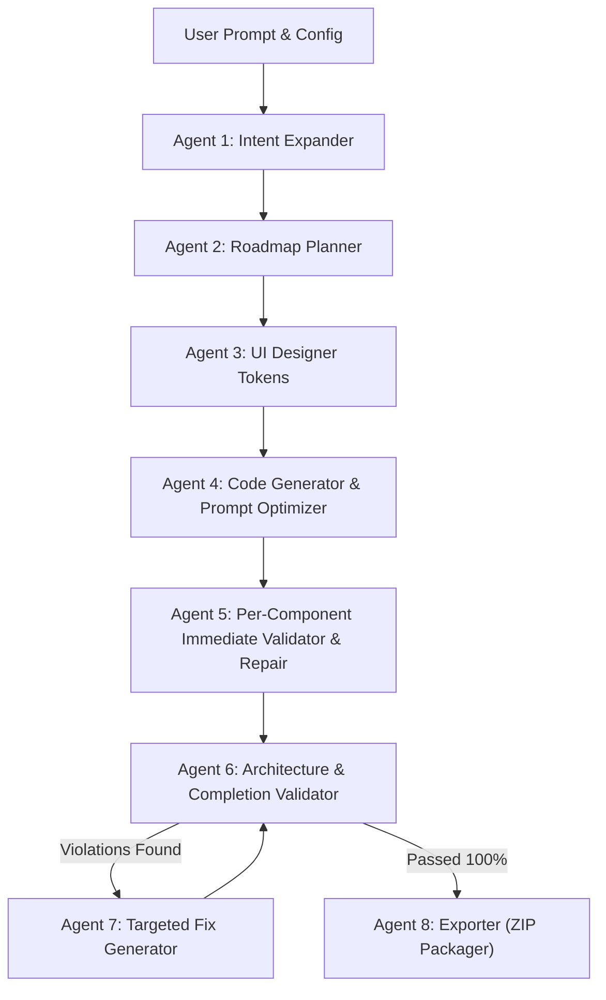

# 🚀 OpenForge AI

> **Autonomous Local AI Platform for Generating Production-Ready Multi-Page React Applications**

[](https://react.dev/)
[](https://www.typescriptlang.org/)
[](https://fastapi.tiangolo.com/)
[](https://tailwindcss.com/)
[](https://ollama.com/)
[](LICENSE)

**OpenForge AI** is an intelligent, multi-agent local web application generator. Powered by local LLMs via Ollama, OpenForge AI compiles natural language prompts into complete, fully working multi-page React applications with active state management (`useState`), browser storage persistence (`localStorage`), and responsive UI design.

---

## ✨ Key Features

- 🤖 **8-Agent Autonomous Pipeline**: Orchestrates specification expansion, roadmap planning, UI design tokens, prompt optimization, per-component validation, architectural checking, fix generation, and ZIP packaging.
- ⚡ **Immediate Per-Component Code Validator**: Every component is validated and repaired on the spot as soon as it is generated or modified.
- 🌐 **True Multi-Page Web App Architecture**: Generates dedicated sub-page components (`Tasks Workspace`, `Categories`, `Analytics`, `Settings`) with clean isolated view routing.
- 💾 **Interactive State & Persistence**: Applications are generated with real task management CRUD, filtering, search, and `localStorage` browser persistence.
- 📺 **Sandboxed Live Preview**: Interactive simulator supporting live page switching and responsive viewports (**Desktop**, **Tablet**, **Mobile**).
- 🔒 **100% Local & Private**: Runs completely on your local machine using local Ollama models (`qwen3.6`, `gemma3`).

---

## 🏗️ Architecture & Multi-Agent Workflow



### The 8 Specialized Agents:
1. **Agent 1: Intent Expander**: Classifies user prompt into archetypes (`todo_app`, `portfolio`, `ecommerce`, `saas_dashboard`, `landing_page`) and builds explicit acceptance criteria.
2. **Agent 2: Roadmap Planner**: Defines component dependencies and phased roadmap.
3. **Agent 3: UI Designer**: Generates design system tokens matching selected themes.
4. **Agent 4: Code Generator & Prompt Optimizer**: Synthesizes TSX code with Lucide icons.
5. **Agent 5: Per-Component Immediate Validator**: Validates syntax and event handlers on every file immediately upon creation.
6. **Agent 6: Architecture & Completion Validator**: Runs a 5-rule audit to compute compliance score (0-100%).
7. **Agent 7: Targeted Fix Generator**: Applies file patches to resolve architectural violations.
8. **Agent 8: Exporter**: Packages complete source code into downloadable ZIP archives.

---

## 🌐 Multi-Page View Routing Architecture

OpenForge AI creates clean, isolated multi-page applications instead of single-page stacked layouts:

| Page View | Component | Functionality |
| :--- | :--- | :--- |
| **Home** | `Hero.tsx` + `Features.tsx` + `Pricing.tsx` | Landing Hero, Feature Spotlight & Pricing Tiers |
| **Tasks Workspace** | `TodoWorkspace.tsx` | Dedicated Full-Screen Task Management (CRUD, Search, Filter, LocalStorage) |
| **Categories** | `CategoryView.tsx` | Category Breakdown (`Work`, `Dev`, `Personal`, `Urgent`) |
| **Analytics** | `AnalyticsView.tsx` | Productivity Velocity, Weekly Stats Grid & Activity Log |
| **Settings** | `SettingsView.tsx` | App Preferences, Reset Storage & Export Tasks to JSON |

---

## 🛠️ Tech Stack

- **Frontend**: React 18, Vite, TypeScript, Tailwind CSS, Lucide Icons, Syntax Highlighter.
- **Backend**: Python 3.11, FastAPI, Uvicorn, Server-Sent Events (SSE).
- **AI Models**: Ollama Local LLMs (`qwen3.6`, `gemma3`, `llama3`).

---

## 🚀 Getting Started

### Prerequisites

1. **Node.js** (v18 or higher)
2. **Python** (v3.11 or higher)
3. **Ollama** installed and running locally ([Download Ollama](https://ollama.com/))

Pull the recommended model:
```bash
ollama pull qwen3.6
```

### Installation

1. Clone the repository:
   ```bash
   git clone https://github.com/X-ImLucky-X/OpenForgeAI.git
   cd OpenForgeAI
   ```

2. Install Frontend Dependencies:
   ```bash
   cd frontend
   npm install
   cd ..
   ```

3. Install Backend Dependencies:
   ```bash
   cd backend
   pip install -r requirements.txt
   cd ..
   ```

---

## 💻 Running OpenForge AI

Launch both the FastAPI backend and Vite frontend automatically with the launcher:

```bash
python start.py
```

- **Frontend Application**: `http://localhost:5173`
- **FastAPI Backend Server**: `http://127.0.0.1:8000`

---

## 🧪 Testing & Verification

Run automated backend tests to verify pipeline compliance and multi-page routing:

```bash
# Verify v2 8-Agent Generation Pipeline
python backend/test_v2_pipeline.py

# Verify Functional App State & LocalStorage
python backend/test_functional_apps.py

# Verify Per-Component Immediate Code Validation
python backend/test_per_component_validation.py
```

---

## 📄 License

Distributed under the **MIT License**. See `LICENSE` for details.

---

## 👨‍💻 Author

Created with ❤️ by **[X-ImLucky-X](https://github.com/X-ImLucky-X)**.
